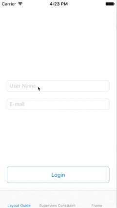
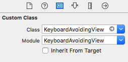

# KeyboardAvoidingView

[](https://github.com/Carthage/Carthage)
[](http://cocoapods.org/pods/KeyboardAvoidingView)
[](http://cocoapods.org/pods/KeyboardAvoidingView)
[](http://cocoapods.org/pods/KeyboardAvoidingView)
[](https://travis-ci.org/APUtils/KeyboardAvoidingView)

Simple solution for keyboard avoiding. View that manages it's bottom constraint constant or frame height to avoid keyboard.

## Example

To run the example project, clone the repo, and run `pod install` from the Example directory first.

## GIF animation



## Installation

#### Carthage

**If you are setting `KeyboardAvoidingView` class in storyboard assure module field is also `KeyboardAvoidingView`**



Please check [official guide](https://github.com/Carthage/Carthage#if-youre-building-for-ios-tvos-or-watchos)

Cartfile:

```
github "APUtils/KeyboardAvoidingView" ~> 4.0
```

Add `KeyboardAvoidingView.framework` and `APExtensionsViewState.framework` frameworks to your project.

#### CocoaPods

KeyboardAvoidingView is available through [CocoaPods](http://cocoapods.org). To install
it, simply add the following line to your Podfile:

```ruby
pod "KeyboardAvoidingView", '~> 4.0'
```

## Usage

Just set `KeyboardAvoidingView` class to any view in storyboard (usually it's base container) that you want to adjust it's bottom constraint or frame height to avoid keyboard, **assure module field is also `KeyboardAvoidingView`**. 


It's also possible to create it from code:
```swift
let keyboardAvoidingView = KeyboardAvoidingView(frame: containerView.bounds)
keyboardAvoidingView.translatesAutoresizingMaskIntoConstraints = true
keyboardAvoidingView.autoresizingMask = [.flexibleWidth, .flexibleHeight]

containerView.addSubview(keyboardAvoidingView)
```

In most cases it should be only one `KeyboardAvoidingView` for screen. Be sure to not create nested `KeyboardAvoidingView`'s.

See example project for more details.

## Contributions

Any contribution is more than welcome! You can contribute through pull requests and issues on GitHub.

## Author

Anton Plebanovich, anton.plebanovich@gmail.com

## License

KeyboardAvoidingView is available under the MIT license. See the LICENSE file for more info.
